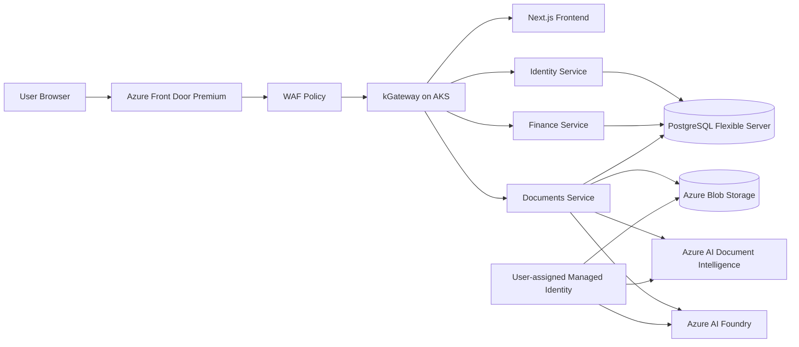

# Azure Architecture Review

## 1. Repository Scan Summary

### Application overview

This repository is a multi-tenant business finance management SaaS called Spend Control Platform. It combines:

- a Next.js 14 frontend
- a shared FastAPI backend split into three AKS service entrypoints
- PostgreSQL for tenant, finance, document, approval, and session data
- Azure Blob Storage for uploaded finance documents
- Azure AI Document Intelligence for OCR and invoice extraction
- Azure AI Foundry / Azure OpenAI for document analysis and finance-aware summarization
- Microsoft Entra ID for workforce accounts plus personal Microsoft-account support

### Components found

- `frontend/`
  - Next.js SPA-style web app
  - MSAL browser auth in production
  - runtime config endpoint for auth wiring
- `backend/`
  - FastAPI codebase
  - combined local app entrypoint
  - AKS split service entrypoints:
    - `identity-service`
    - `finance-service`
    - `documents-service`
- `infra/helm/business-ai-app/`
  - production Helm chart for frontend plus three backend services
  - Gateway API `Gateway` and `HTTPRoute` resources
- `infra/k8s/`
  - raw Kubernetes manifests mirroring the Helm topology
- `terraform/azure/aks/`
  - current Azure source of truth
  - provisions AKS, Front Door, WAF, PostgreSQL, Blob Storage, Entra apps, Workload Identity, and Azure AI services
- `terraform/azure/vm-docker/`, `infra/vm/`, `infra/vmss/`
  - older alternative deployment patterns for VMs / VMSS / Application Gateway
  - no longer the primary production path
- `docs/`
  - current Azure architecture notes, deployment runbooks, and agent context

### Current deployment model

The active deployment model in the repository is:

- Azure Front Door Premium + WAF
- HTTPS origin forwarding to kGateway on AKS
- Gateway API `HTTPRoute` fan-out to:
  - frontend
  - identity-service
  - finance-service
  - documents-service
- PostgreSQL Flexible Server
- Azure Blob Storage
- Azure AI Foundry
- Azure AI Document Intelligence
- Workload Identity with one user-assigned managed identity

Terraform also builds and pushes container images with `az acr build` when enabled, and installs Helm releases during apply.

No GitHub Actions or Azure DevOps pipeline definitions were found in the repository. CI/CD is currently implied by docs and local CLI/Terraform execution, not codified in a committed pipeline.

### Current infrastructure assumptions

The current AKS Terraform assumes:

- one Azure subscription
- one resource group for the current stack
- one VNet with:
  - one AKS subnet
  - one delegated PostgreSQL subnet
- one AKS cluster with:
  - system node pool
  - user node pool
- one PostgreSQL logical database shared by all backend services
- one shared user-assigned managed identity for all app pods
- one Azure Container Registry
- one Front Door profile and endpoint
- one custom domain currently mapped manually from Hostinger

### Current security posture

Positive findings:

- Front Door Premium with WAF is in place
- Entra auth is multi-tenant and session-aware
- backend validates Entra tokens and enforces tenant-aware RBAC
- Workload Identity is enabled on AKS
- backend uses `DefaultAzureCredential` for Blob Storage and Azure AI access
- PostgreSQL uses private access in a delegated subnet
- Blob container is private
- local users are disabled on the storage account
- TLS is enabled at Front Door and on the AKS gateway origin path

Gaps:

- AKS API server is public by default because `private_cluster_enabled = false`
- `authorized_ip_ranges` defaults to empty
- storage account still allows public network access
- storage account still has shared-key auth enabled
- Document Intelligence and Foundry are still public-network-enabled
- no Azure Key Vault in the active design
- Terraform passes the database connection string into Helm values and therefore into Terraform state
- the Front Door origin uses a self-signed certificate and `certificate_name_check_enabled = false`
- no Kubernetes network policies are configured
- no Azure Firewall, no NAT Gateway, and no private ingress origin path
- no committed Azure Policy assignments or Defender for Cloud configuration in the active stack

### Current scalability posture

Positive findings:

- frontend and backend services run with multiple replicas
- AKS node pools use cluster autoscaler
- Front Door and WAF provide global edge scaling
- PostgreSQL Flexible Server and Blob Storage are managed services

Gaps:

- Helm HPA settings exist but autoscaling is disabled for all app services
- document processing is synchronous, not queue-driven
- all backend services share one PostgreSQL database
- the documents service can become the hot path under bursty upload and scan traffic
- node pools are small and not zone-aware in the current Terraform

### Current HA / reliability posture

Positive findings:

- Front Door health probes `/health`
- the AKS gateway has multiple pods
- all app services run two replicas
- PostgreSQL now has zone-redundant HA and geo-redundant backup
- storage is durable managed PaaS

Gaps:

- the design is still single-region
- AKS node pools are not explicitly spread across availability zones
- the AKS control plane is not private
- no Application Insights resource is provisioned
- no diagnostic settings or alert rules are provisioned for Front Door, AKS, PostgreSQL, Storage, or Azure AI services
- no formal rollback pipeline exists

### Current cost posture

Positive findings:

- minimal AKS node sizes are used
- one shared managed identity is used instead of many
- one shared PostgreSQL server and one shared storage account reduce footprint
- single-region deployment avoids unnecessary multi-region spend

Risks:

- AKS may be more expensive operationally than necessary for the current application size
- dev, staging, and prod subscription/resource separation is not encoded in the current stack
- there are legacy VM, VMSS, and AKS deployment paths in the repo, which can lead to duplicated cost if operated in parallel
- no log retention or monitoring cost controls are provisioned
- no budgets or cost alerts are codified

## 2. Current Architecture

### Current architecture discovered from the repository

The current application is an AKS-hosted microservice-style web platform with one web frontend and three backend service entrypoints sharing one relational database.

The request flow is:

1. User opens the app through Azure Front Door.
2. Front Door WAF terminates edge TLS and forwards to the AKS gateway over HTTPS.
3. kGateway receives the request.
4. `HTTPRoute` rules route to either frontend, identity, finance, or documents service.
5. Backend services persist data in one PostgreSQL database.
6. Documents service stores uploaded files in Blob Storage.
7. Documents service calls Document Intelligence and Azure AI Foundry using managed identity.

### Mermaid diagram of the current architecture

## 3. Production Requirements

For this specific application, a production-grade Azure design needs to satisfy the following:

### Security

- secure public entry for internet users
- strong tenant-aware auth and RBAC
- secretless service-to-service access where possible
- private data-plane access for database, storage, and AI services where practical
- least-privilege identity model for CI/CD and workloads
- auditable admin and session actions

### Scalability

- separate scaling behavior for:
  - frontend traffic
  - auth/session traffic
  - finance API traffic
  - document upload and analysis traffic
- managed data services that can scale independently of AKS nodes
- optional async path for heavy document-processing bursts later

### High availability

- multiple app instances
- zone-aware compute where cost allows
- database HA
- edge load balancing and health probing
- backup/restore path for regional failure

### Reliability

- clean health checks
- rollback-capable deployment process
- centralized logs, metrics, and alerts
- resilient auth and session handling
- predictable dependency behavior when AI services are slow or unavailable

### Observability

- application logs and metrics
- distributed troubleshooting across Front Door, AKS, PostgreSQL, Storage, and Azure AI services
- operational alerts for auth failures, scan failures, database saturation, and pod health

### Cost optimization

- avoid unnecessary multi-region
- avoid unnecessary hub-and-spoke network complexity
- avoid unnecessary third subscription if the workload does not justify it
- scale prod strongly, keep non-prod lighter
- share only the resources that do not materially increase risk

### Operational simplicity

- one clear deployment path
- one clear source of truth for infrastructure
- minimal manual portal work
- service choices that match the current application shape and team maturity

## 4. Architecture Options Compared

### Option A: Simple cost-optimized production setup

Pattern:

- one subscription
- separate resource groups for dev, staging, and prod
- some lower-environment resources shared where safe
- prod isolated mostly by RBAC and resource group boundaries

Fit for this app:

- enough for an early-stage SaaS with small team size
- not enough if customer or compliance review expects stronger blast-radius isolation

Benefits:

- lowest operational complexity
- easiest billing and governance to start with
- fastest to implement from the current repo

Drawbacks:

- weaker production isolation
- easier for non-prod identities and automation to overreach into prod
- weaker budget segmentation
- weaker incident blast-radius control

### Option B: Environment-separated production setup

Pattern:

- one subscription
- separate resource groups and VNets per environment
- no shared data-plane resources across environments
- optional shared ACR and monitoring only if justified

Fit for this app:

- workable if the organization is not ready for multi-subscription governance
- better than Option A for network isolation

Benefits:

- clearer environment boundaries
- easier private networking per environment
- lower complexity than multi-subscription

Drawbacks:

- production still shares the same subscription blast radius
- RBAC and quota issues can still affect prod from non-prod work

### Option C: Multi-subscription enterprise setup

Pattern:

- separate subscriptions for dev, staging, and prod
- optional shared platform/connectivity subscription
- stronger policy and budget segmentation

Fit for this app:

- technically strong
- likely over-architecture for the current application unless enterprise governance already requires it

Benefits:

- strongest blast-radius isolation
- strongest RBAC and policy boundaries
- clean budget ownership

Drawbacks:

- highest operational complexity
- more CI/CD wiring
- more identity, policy, and networking coordination
- more platform overhead than the app currently needs

### Option D: Hybrid recommended setup

Pattern:

- two subscriptions:
  - non-prod
  - prod
- shared nothing sensitive between prod and non-prod
- same architecture pattern across environments
- lighter non-prod SKUs
- keep the AKS-based topology because it matches the repository and current runtime

Fit for this app:

- best balance of production credibility, security isolation, and cost
- strong enough for a finance-focused SaaS without jumping straight to a full enterprise landing-zone model

Benefits:

- real production isolation
- lower complexity than three subscriptions
- easier cost tracking and policy separation
- retains parity with the current app design

Drawbacks:

- more complex than single-subscription
- still not a full enterprise platform model

### Option comparison table

| Option | Security isolation | Cost | Ops complexity | Suitability |
|---|---|---:|---:|---|
| A: 1 subscription, RG split | Low to medium | Lowest | Lowest | Acceptable only for early-stage production |
| B: 1 subscription, RG + VNet split | Medium | Low to medium | Medium | Reasonable but weaker prod blast-radius control |
| C: 3 subscriptions or hub-spoke enterprise | Highest | Highest | Highest | Strong but overbuilt for this app today |
| D: 2 subscriptions hybrid | High | Medium | Medium | Best fit for this application |

## 5. Subscription Strategy Comparison

### 1 subscription with multiple resource groups

What it looks like:

- one subscription
- `rg-dev`, `rg-staging`, `rg-prod`

Benefits:

- simplest to run
- lowest coordination overhead

Drawbacks:

- prod and non-prod share quotas and policy scope
- weaker separation for a finance application

Verdict:

- too weak as the final recommendation for this app

### 1 subscription with separate VNets and resource groups per environment

What it looks like:

- one subscription
- one VNet per environment
- one resource group per environment

Benefits:

- better network separation
- still simple to understand

Drawbacks:

- prod still shares subscription-level blast radius

Verdict:

- acceptable fallback if the org cannot support multiple subscriptions yet

### 2 subscriptions: non-prod and prod

What it looks like:

- non-prod subscription:
  - dev
  - staging
- prod subscription:
  - production only

Benefits:

- strong production isolation
- clear budget and RBAC boundaries
- still manageable for a small-to-medium platform team

Drawbacks:

- more work than a single subscription

Verdict:

- best fit for this application

### 3 subscriptions: dev, staging, prod

What it looks like:

- one subscription per environment

Benefits:

- maximum environment isolation

Drawbacks:

- more operational overhead than current app maturity justifies
- staging isolation is nice, but not enough to outweigh the complexity today

Verdict:

- not necessary yet

### Enterprise landing zone with connectivity/platform subscriptions

What it looks like:

- shared services subscription
- connectivity/hub subscription
- workload subscriptions per environment

Benefits:

- best for large organizations with many applications and central platform teams

Drawbacks:

- clearly over-engineered for this single application at current scale

Verdict:

- not recommended for this app now

### Final subscription recommendation

Recommend:

- **two subscriptions**
  - one non-prod subscription
  - one prod subscription

Reason:

- this finance SaaS has enough sensitivity to justify a dedicated prod boundary
- it does not yet justify a full three-subscription or landing-zone design

## 6. Service Choice Comparison

### App Service vs Container Apps vs AKS vs VMs

| Choice | Pros | Cons | Decision |
|---|---|---|---|
| App Service | simple PaaS, low ops | weaker fit for current multi-service routing and Gateway API model | Rejected |
| Container Apps | simpler than AKS, good for small container workloads | would require reworking the current Helm, Gateway API, and kGateway operating model | Considered but not selected |
| AKS | matches current repo, service split, Helm, Gateway API, Workload Identity | highest ops burden of the viable options | Selected |
| VMs / VMSS | full control | highest ops burden, weakest modern platform fit | Rejected |

Decision:

- keep **AKS** for this project review because the repository is already built around AKS, Helm, kGateway, Gateway API, and microservice separation
- if this were a greenfield redesign with no AKS investment, Azure Container Apps would be the first simplification to evaluate

### Azure Front Door vs Application Gateway vs Load Balancer

| Choice | Pros | Cons | Decision |
|---|---|---|---|
| Front Door Premium | global edge, WAF, custom domains, health probes, TLS, bot/rate controls | does not replace internal cluster routing | Selected |
| Application Gateway / AGIC | strong regional L7 gateway, Azure-native enterprise ingress | extra hop, extra cost, AGIC is the older model, not aligned to current `HTTPRoute` design | Rejected for this app |
| Azure Load Balancer only | cheap, simple L4 | no WAF, no path routing, no global edge | Rejected |

Decision:

- keep **Front Door Premium + WAF** as public ingress
- keep **kGateway** for AKS-native route distribution

### Azure Firewall vs NSG-only

Decision:

- do **not** recommend Azure Firewall yet
- recommend:
  - NSGs
  - private endpoints
  - private AKS API for prod
  - Front Door WAF

Reason:

- Azure Firewall adds cost and complexity without a clear requirement discovered in the current repo

### Public DB access vs private access

Decision:

- keep **PostgreSQL private access only**
- extend the same principle to Storage, Key Vault, and Azure AI services in the recommended target architecture

### Single-region vs multi-region

Decision:

- recommend **single-region with zone redundancy**
- do **not** recommend active-active multi-region now

Reason:

- the app is not yet mature enough to justify multi-region app, data, CI/CD, and failover complexity
- geo-backup plus documented regional DR is the right balance

### Shared resources vs isolated resources

Recommended sharing:

- non-prod monitoring workspace per subscription
- non-prod ACR per subscription

Recommended isolation:

- production AKS cluster
- production PostgreSQL
- production storage account
- production Key Vault
- production Front Door profile
- all prod identities and secrets

## 7. Cost Optimization Analysis

### Exact cost-saving decisions

- keep **single region**
  - avoid active-active multi-region cost
- use **two subscriptions**, not three
  - enough prod isolation without unnecessary overhead
- keep **AKS only where it materially matches the repo**
  - do not add Application Gateway, Azure Firewall, or hub-spoke networking unless requirements emerge
- use **lower SKUs in non-prod**
  - smaller PostgreSQL compute
  - smaller AKS node counts
  - lower Front Door usage profile
- use **cluster autoscaler and HPA**
  - scale on demand instead of permanent overprovisioning
- use **storage lifecycle policies**
  - cold/archive older documents if business rules allow
- set **monitor retention by environment**
  - shorter in dev
  - longer in prod for audit needs
- keep **one logical Postgres database per environment**
  - no need for service-specific databases yet

### What can be shared safely

- non-prod ACR
- non-prod monitoring workspace if the team accepts shared observability for lower environments

### What should not be shared

- prod data-plane services
- prod identities
- prod Key Vault
- prod AKS cluster
- prod Front Door

## 8. Final Recommendation

### Final recommended architecture

Recommend **Option D: a hybrid two-subscription Azure architecture**:

- **non-prod subscription**
  - dev and staging resource groups
  - isolated VNets per environment
  - same AKS-based application pattern
  - lighter SKUs
- **prod subscription**
  - dedicated prod resource groups
  - dedicated prod VNet
  - dedicated prod AKS cluster
  - dedicated prod PostgreSQL, Storage, Key Vault, and Front Door

Core service decisions:

- **AKS** remains the compute platform
- **kGateway + Gateway API** remain the in-cluster ingress pattern
- **Azure Front Door Premium + WAF** remains the public edge
- **PostgreSQL Flexible Server** remains the relational store
- **Blob Storage** remains the document store
- **Azure AI Foundry** and **Document Intelligence** remain the AI/OCR services
- add **Key Vault**, **Application Insights**, **Azure Monitor alerts**, **private endpoints**, and **diagnostic settings** as the next production-hardening layer

## 9. Why This Is Not Over-Engineered

This recommendation is not over-engineered because it intentionally avoids:

- three full environment subscriptions
- hub-and-spoke enterprise networking
- Azure Firewall
- multi-region active-active
- extra regional L7 layers like Application Gateway in front of AKS
- a database per microservice
- queue/event infrastructure that the current app does not yet require

It is production-grade because it keeps:

- clear prod isolation
- managed data services
- strong public edge security
- tenant-aware auth and RBAC
- zone-aware HA at the database layer
- room to add autoscaling and observability cleanly

## 10. Review Talking Points

- The application is a multi-tenant finance SaaS, so the architecture prioritizes tenant isolation, secure auth, and auditable admin flows over generic web-hosting simplicity.
- The current codebase is already AKS-native: Helm, kGateway, and Gateway API are first-class deployment assets, so AKS is the right compute choice for this specific project review.
- We deliberately chose a two-subscription model because production needs a real blast-radius boundary, but three subscriptions would add governance overhead without proportionate value today.
- Front Door Premium with WAF is the right public edge because the app is internet-facing, custom-domain-based, and user-latency-sensitive.
- PostgreSQL Flexible Server is the right database because the app uses relational entities like organizations, memberships, sessions, budgets, expenses, approvals, and documents.
- Managed identity is already the correct access pattern for Blob Storage and Azure AI services; the next improvement is to add Key Vault and private endpoints so secrets and data-plane traffic are hardened further.
- Single-region with zone redundancy is the correct cost/reliability balance now; multi-region DR can come later if business RTO/RPO requirements tighten.
- The biggest current production gaps are not the core service choices, but the remaining hardening gaps: no Key Vault, public AKS API, public AI/storage endpoints, no HPA, and no committed CI/CD pipeline definition.
