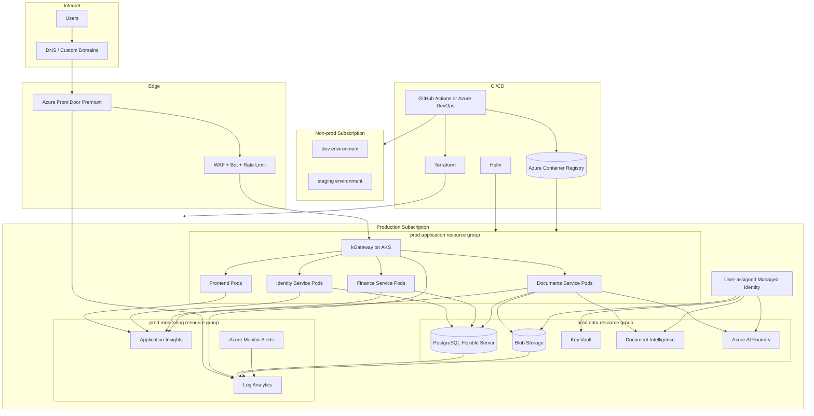

# Final Azure Architecture

## 1. Architecture Overview

This is the recommended production Azure architecture for this repository and application shape.

It keeps the current strengths of the codebase:

- AKS-native deployment
- Gateway API routing
- Front Door as the public edge
- managed PaaS data services
- Workload Identity
- Entra multi-tenant auth

It improves the current live deployment by adding stronger environment separation, better secrets handling, better observability, and clearer production boundaries.

### Final recommendation summary

- **Subscriptions**
  - `nonprod` subscription
  - `prod` subscription
- **Compute**
  - AKS
- **Ingress**
  - Azure Front Door Premium + WAF
  - kGateway on AKS
  - Gateway API `HTTPRoute`
- **Database**
  - Azure Database for PostgreSQL Flexible Server
- **Storage**
  - Azure Storage Account / Blob Storage
- **Identity and secrets**
  - Microsoft Entra ID
  - User-assigned managed identity
  - Azure Key Vault
- **AI services**
  - Azure AI Document Intelligence
  - Azure AI Foundry / Azure OpenAI
- **Observability**
  - Log Analytics
  - Application Insights
  - Azure Monitor alerts

## 2. Final Architecture Diagram

## 3. Environment Strategy

### Dev environment

- lives in the `nonprod` subscription
- separate dev resource group and dev VNet
- lower SKU PostgreSQL
- lower node count AKS
- smaller log retention
- developer-friendly auth/test data

### Staging environment

- also lives in the `nonprod` subscription
- separate staging resource group and staging VNet
- mirrors prod routing and auth flow
- used for release validation and Entra callback testing

### Production environment

- dedicated `prod` subscription
- dedicated AKS cluster
- dedicated PostgreSQL, Storage, Key Vault, Front Door, and monitoring
- stricter RBAC and policy

### What is shared

Recommended shared resources:

- non-prod ACR
- non-prod monitoring workspace if desired

### What is isolated

- all prod data resources
- prod AKS
- prod secrets
- prod identities
- prod Front Door

### Why this approach was chosen

It gives:

- real production isolation
- lower cost than three full subscriptions
- enough separation for a finance SaaS review
- minimal architectural rework from the current repo

### Current Terraform state posture

- the current live stack is tracked in the Terraform CLI workspace `dev`
- the backend is Azure Blob Storage in:
  - resource group `terra-rg`
  - storage account `lijazterracount`
  - container `terracontainer`
  - blob key `spendpilot.tfstate`
- `default` is intentionally empty
- `staging` and `prod` exist only as empty placeholders for future use
- the configuration is not yet workspace-parameterized, so only `dev` should be planned/applied for now

## 4. Subscription and Resource Group Design

### Subscriptions selected

- `spend-control-nonprod`
- `spend-control-prod`

### Suggested resource groups

Non-prod:

- `rg-spctl-dev-app-ci`
- `rg-spctl-stg-app-ci`
- `rg-spctl-nonprod-shared-ci`

Prod:

- `rg-spctl-prod-app-ci`
- `rg-spctl-prod-data-ci`
- `rg-spctl-prod-monitor-ci`

### Naming convention

Pattern:

- `rg-<app>-<env>-<purpose>-<region-code>`
- `aks-<app>-<env>-<region-code>`
- `pg-<app>-<env>-<region-code>`
- `st<app><env><regioncode>`
- `fd-<app>-<env>`

Example:

- `aks-spctl-prod-ci`
- `pg-spctl-prod-ci`
- `fd-spctl-prod`

### RBAC boundary

- subscription boundary isolates prod from non-prod
- resource group boundary separates app, data, and monitoring roles
- cluster access uses Azure RBAC and Entra groups

### Cost boundary

- per-subscription budgets
- separate prod and non-prod cost ownership

## 5. Networking Design

### VNet design

Per environment:

- one dedicated VNet

Prod VNet example:

- `10.40.0.0/16`

### Subnet design

Recommended prod subnets:

- `aks-system-apps-subnet`
  - AKS nodes
- `postgres-subnet`
  - delegated to PostgreSQL Flexible Server
- `private-endpoints-subnet`
  - Storage
  - Key Vault
  - AI services

### NSGs

- NSG on AKS node subnet
- NSG on private endpoint subnet if required by org standards
- deny-by-default inbound posture except required Azure-managed service flows

### Private Endpoints

Recommended in prod:

- Blob Storage
- Key Vault
- Document Intelligence
- Azure AI Foundry, if supported for the exact service path used

Not used for PostgreSQL Flexible Server here because the repo already uses delegated private access for PostgreSQL, which is the right model for that service.

### Private DNS Zones

Recommended zones:

- `privatelink.blob.core.windows.net`
- `privatelink.vaultcore.azure.net`
- `privatelink.cognitiveservices.azure.com`
- `<env>.postgres.database.azure.com` private zone for PostgreSQL

### NAT Gateway

Not required now.

Use NAT Gateway later only if:

- external vendors must allowlist a fixed outbound IP
- the app starts calling non-Azure third-party systems that need stable egress

### Public ingress path

- custom domain
- Azure Front Door Premium
- WAF
- HTTPS origin to kGateway on AKS

### Private internal traffic path

- kGateway routes internally to ClusterIP services
- backend services access PostgreSQL over private network
- backend services access Storage, Key Vault, and AI services through managed identity and private endpoints where enabled

### Outbound internet path

- Azure-managed outbound from AKS
- no Azure Firewall in the recommended design yet

### Why resources are public or private

Public:

- Front Door
- AKS ingress public edge only

Private:

- PostgreSQL
- Key Vault
- Storage data plane
- AI services where supported and operationally justified

## 6. Ingress and Traffic Flow

### User to Frontend flow

1. User resolves `myfinagent.online`.
2. DNS points to Azure Front Door.
3. Front Door terminates TLS at the edge.
4. WAF and bot/rate-limit policies are applied.
5. Front Door forwards the request over HTTPS to the AKS gateway.
6. kGateway matches `/` and routes to the frontend service.
7. Frontend returns the rendered app shell and runtime configuration.

### Frontend to Backend/API flow

1. Browser uses same-origin `/api`.
2. Request again hits Front Door.
3. Front Door forwards to kGateway.
4. `HTTPRoute` selects the target service:
   - `/api/auth`, `/api/admin`, `/health`, `/ready` -> identity-service
   - `/api/finance` -> finance-service
   - `/api/documents`, `/api/ai` -> documents-service
5. Backend validates the Entra token and maps the user into the correct tenant workspace and role.

### Backend to Database flow

1. Backend pod gets credentials from environment or Key Vault-backed secret injection.
2. Connection goes to PostgreSQL Flexible Server over private network.
3. All services use the same logical database but scope reads/writes by `organization_id`.

### Backend to Blob Storage flow

1. Documents service requests a token through the user-assigned managed identity.
2. `DefaultAzureCredential` obtains the access token.
3. Storage Blob Data Contributor RBAC allows blob operations.
4. Traffic goes to the storage account data plane, preferably over private endpoint in prod.

### Admin / developer access flow

1. Developers authenticate with Entra.
2. Azure RBAC controls subscription/resource access.
3. AKS access uses Azure RBAC and cluster credentials, not long-lived static kubeconfigs stored in code.
4. Secrets are read from Key Vault or deployment-time secret injection, not from committed `.tfvars` or `.env`.

## 7. Compute Design

### Chosen compute service

- **Azure Kubernetes Service**

### Why AKS was selected

- the repo already uses Helm and Gateway API
- the app already has three backend service entrypoints
- kGateway is already the ingress/routing control plane
- Workload Identity is already implemented
- the production deployment path is already AKS-native

### How it scales

- cluster autoscaler on system and user pools
- HPA enabled per service in the recommended target state
- optional KEDA later if document processing becomes event-driven

### How deployments work

- build container images
- push to ACR
- deploy infrastructure with Terraform
- deploy app with Helm

### How health checks work

- Front Door probes `/health`
- Kubernetes readiness/liveness checks run per pod

### How rollback works

- Helm rollback for application manifests
- image pinning by tag or digest in CI/CD
- Terraform plan approval before infra changes

## 8. Database Design

### Database service selected

- **Azure Database for PostgreSQL Flexible Server**

### Why it fits this app

The app has strongly relational entities:

- organizations
- users
- memberships
- sessions
- budgets
- expenses
- approvals
- documents
- scans
- audit events

This is a natural PostgreSQL workload, not a Cosmos DB or object-store-first design.

### HA configuration

Recommended prod shape:

- General Purpose tier
- zone-redundant HA
- geo-redundant backup enabled

### Backup configuration

- PITR enabled through Flexible Server backups
- geo-redundant backup for regional restore

### Private access

- delegated subnet private access only

### Scaling strategy

- scale compute independently from AKS
- keep one database per environment
- only split databases later if workload, compliance, or tenancy scale demands it

### Connection security

- SSL required
- credentials stored in Key Vault
- least-privilege database user for app access recommended

### Failover behavior

- zone-redundant HA handles zonal database failure
- regional disaster handled by restore from geo-backup, not active-active replication

### Cost tier suggestion

- dev: lower General Purpose or Burstable if HA is not required
- staging: smaller General Purpose
- prod: General Purpose with HA and geo-backup

## 9. Storage Design

### Storage account usage

- uploaded expense documents
- scanned document artifacts

### Blob containers

- one private container per environment
- optional future split between raw uploads and processed artifacts

### Redundancy choice

- dev/staging: LRS is acceptable
- prod: consider ZRS if supported and justified by cost and regional design

### Public access

- anonymous public blob access disabled
- storage account data plane should be private in prod

### Private Endpoint

- recommended for prod

### Managed identity access

- keep user-assigned managed identity with `Storage Blob Data Contributor`

### Lifecycle management

- move old documents to cool/archive tiers if retention policy allows

### Backup / retention strategy

- retention governed by finance and audit requirements
- do not rely only on application database references

## 10. Secrets and Identity Design

### Managed identities

- one user-assigned managed identity per environment for workloads

### Key Vault

- required in the final recommended architecture

Use Key Vault for:

- PostgreSQL connection secret
- any future API keys or non-Entra credentials
- certificate or secret material not suitable for Terraform state

### Secretless access

- Storage: managed identity
- Document Intelligence: managed identity
- Azure AI Foundry: managed identity where supported by the exact SDK path

### RBAC

- Azure RBAC for platform access
- app RBAC for tenant/user permissions

### CI/CD identity

- use federated workload identity from GitHub Actions or Azure DevOps service connection
- avoid stored long-lived client secrets

### Least privilege model

- separate platform admins from tenant admins
- separate prod deployment identity from non-prod deployment identity

## 11. Security Design

### WAF

- Azure Front Door Premium WAF
- managed rules enabled
- bot protection enabled
- custom rate-limit rule on `/api/auth`

### TLS

- TLS at the edge
- HTTPS from Front Door to origin
- SSL required for PostgreSQL

### NSGs

- subnet-level NSGs
- deny-by-default except required flows

### Private networking

- prod AKS control plane should be private if the ops model supports it
- PostgreSQL private access
- storage and AI services via private endpoints in prod

### RBAC

- Entra groups for Azure resource roles
- app-level RBAC for `platform_admin`, `org_admin`, `finance_manager`, `approver`, `auditor`, `employee`

### Azure Policy

Recommended:

- require tags
- block public IPs except approved ingress resources
- require TLS 1.2+
- audit Key Vault usage
- audit private endpoint usage for sensitive PaaS

### Defender for Cloud

- recommended for prod subscription

### Audit logging

- app audit events already exist in the database
- add Azure resource diagnostics to Log Analytics

### Threat protection

- Front Door WAF
- platform DDoS protection inherent at Front Door edge

## 12. Scalability Design

### Horizontal scaling

- frontend and backend services scale horizontally in AKS

### Autoscaling

- cluster autoscaler for nodes
- HPA for each service

### Database scaling

- scale PostgreSQL vertically first
- only split workloads later if read/write pressure demands it

### Storage scaling

- Blob Storage scales independently and is not likely to be a near-term bottleneck

### Queue / event-based scaling

Not required yet.

Future trigger:

- if scan/extraction volume grows enough to hurt request latency, move document analysis to async queue-based processing and scale the documents worker separately

### Regional scaling considerations

- not recommended yet
- single-region plus zone redundancy is enough for now

## 13. High Availability Design

### Zone redundancy

- PostgreSQL HA is zone-redundant
- recommended future improvement: zone-aware AKS node pools if quota and cost allow

### Multi-instance design

- each app workload runs multiple replicas

### Load balancing

- Front Door global edge
- kGateway in-cluster routing

### Database HA

- Flexible Server zone-redundant HA

### Storage redundancy

- prod should consider ZRS where justified

### Backup and restore

- PostgreSQL backups and geo-backup
- document data retained in Blob Storage

### Regional DR decision

- no active-active multi-region
- regional outage response is restore/redeploy into another region using Terraform and backups

### RTO / RPO assumptions

- node or pod failure: minutes
- single-zone database failure: platform-managed failover
- regional disaster: hours, not minutes, because the design is restore-based not active-active

## 14. Observability Design

### Application Insights

- workspace-based Application Insights per environment

### Log Analytics Workspace

- one per subscription or one per environment depending on governance preference

### Azure Monitor

- metric alerts
- log alerts
- action groups

### Recommended alert rules

- Front Door origin health failures
- WAF spikes or excessive blocks
- AKS node pressure
- pod crash loops
- HPA maxed out
- PostgreSQL CPU, connections, storage, failover events
- storage throttling or auth failures
- document scan failure rate
- Entra token validation failure spikes

### Dashboards

- platform dashboard
- auth dashboard
- finance API dashboard
- document processing dashboard

## 15. CI/CD Design

### Pipeline platform

- GitHub Actions or Azure DevOps

### Build stage

- build frontend image
- build backend image
- SBOM and image metadata generation

### Test stage

- backend tests
- frontend lint/build
- Helm template/render validation
- Terraform fmt/validate/plan

### Security scan stage

- dependency scan
- container image scan
- IaC scan

### Deploy to dev

- automatic on merge to main or dev branch

### Deploy to staging

- automatic after dev or on release branch

### Approval before prod

- manual approval gate

### Deploy to prod

- Terraform plan and apply
- Helm upgrade

### Rollback approach

- Helm rollback for app
- revert to previous image digest
- controlled Terraform rollback only for safe infra changes

### Infrastructure as Code workflow

- no direct portal drift for managed resources
- Terraform state stored remotely
- production plans reviewed before apply

## 16. Cost Optimization Design

### Cost-saving decisions

- two subscriptions, not three
- single region, not multi-region active-active
- no Azure Firewall
- no Application Gateway in front of AKS
- no queue infrastructure until documents traffic proves it is needed

### Shared resources

- non-prod ACR
- optional non-prod monitoring workspace

### Dev / test lower SKUs

- smaller AKS node counts
- lower PostgreSQL compute
- shorter retention

### Autoscaling

- HPA
- cluster autoscaler

### Shutdown schedules

- optional for non-prod data science or auxiliary workloads
- not for core shared AKS if dev/staging are used continuously

### Log retention

- lower retention in non-prod
- compliance-driven retention in prod

### Storage lifecycle

- archive older blobs

### Budgets and alerts

- required on both subscriptions

### Why unnecessary services were avoided

- Azure Firewall: no clear repo-driven requirement
- Cosmos DB: wrong data model
- Azure SQL Database: PostgreSQL is already the natural fit and already implemented
- multi-region active-active: too expensive and complex for current need
- Application Gateway / AGIC: redundant with current Front Door + kGateway topology

## 17. Failure Scenarios and How the Architecture Handles Them

### One app instance fails

- Kubernetes reschedules or serves from remaining replicas

### One availability zone fails

- PostgreSQL HA handles zonal database failure
- app remains available if node pools are made zone-aware as recommended

### Database primary fails

- Flexible Server HA fails over

### Storage access issue

- document upload and scan paths fail gracefully
- app logs and alerts surface the dependency issue

### Bad deployment

- Helm rollback to previous release
- redeploy prior image digest

### Secret rotation

- rotate in Key Vault
- refresh deployment references

### Traffic spike

- Front Door absorbs edge load
- AKS HPA and cluster autoscaler scale out
- document workloads can later move to async workers if spikes become frequent

### Regional outage

- no active-active failover
- restore-based DR using Terraform, backups, container images, and documented runbooks

## 18. Final Review Summary

This architecture is:

- **Secure**
  - strong edge protection
  - private data plane for critical services
  - managed identity and Key Vault
- **Reliable**
  - managed data services
  - health probing
  - rollback-capable deployment model
- **Highly available**
  - multiple app instances
  - database HA
  - global edge ingress
- **Scalable**
  - AKS horizontal scaling
  - independent PaaS scaling
  - clean service boundaries
- **Cost-conscious**
  - no unnecessary hub-spoke
  - no unnecessary multi-region
  - two subscriptions instead of three
- **Production-grade**
  - appropriate isolation for a finance SaaS
  - strong Azure-native controls
- **Not over-engineered**
  - every selected service solves a real problem found in this repository
